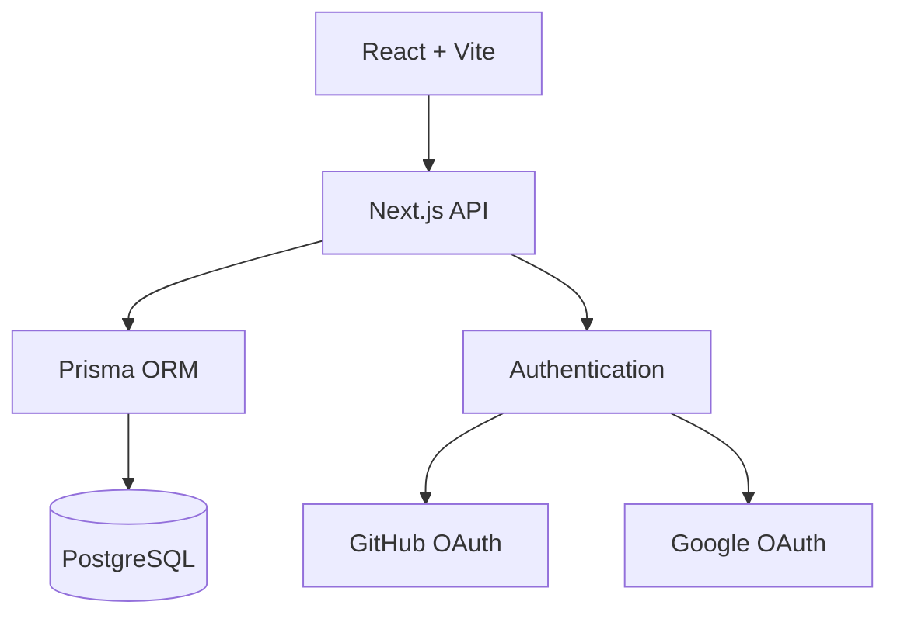

# DevLink

<p align="center">
  
</p>

<h1 align="center">DevLink</h1>

<p align="center"><strong>Build With People Who Actually Ship.</strong></p>

<p align="center">
A modern collaboration platform where developers, founders, designers, AI engineers, and builders discover teammates, collaborate on projects, and launch products together.
</p>

<p align="center">
  
  
  
  
  
</p>

<p align="center">
<a href="#overview">Overview</a> •
<a href="#features">Features</a> •
<a href="#architecture">Architecture</a> •
<a href="#tech-stack">Tech Stack</a> •
<a href="#getting-started">Getting Started</a> •
<a href="#roadmap">Roadmap</a> •
<a href="#contributing">Contributing</a>
</p>

---

# Overview

DevLink is an open-source collaboration platform that helps developers, founders, designers, AI engineers, and builders find teammates, join projects, collaborate efficiently, and launch products together.

## Why DevLink?

- Discover talented builders
- Find meaningful projects
- Form startup teams
- Collaborate in one place
- Build products faster

---

# Features

- Builder Discovery
- Project Marketplace
- Team Matching
- Builder Profiles
- Startup Hub
- Real-time Messaging
- Collaboration Workspace
- Reputation System
- AI-powered Recommendations

---

# Architecture



---

# Tech Stack

| Layer | Technology |
|------|------------|
| Frontend | React, TypeScript, Vite, Tailwind CSS, shadcn/ui |
| Backend | Next.js API Routes, Node.js |
| Database | PostgreSQL |
| ORM | Prisma |
| Authentication | Clerk / NextAuth |
| Deployment | Vercel, Neon |

---

# Project Structure

```text
devlink/
├── docs/
│   └── screenshots/
├── prisma/
├── public/
├── src/
│   ├── assets/
│   ├── components/
│   ├── hooks/
│   ├── layouts/
│   ├── lib/
│   ├── pages/
│   ├── services/
│   ├── styles/
│   ├── types/
│   └── utils/
├── README.md
├── CONTRIBUTING.md
├── LICENSE
└── package.json
```

---

# Getting Started

## Prerequisites

- Node.js 20+
- npm
- Git

## Installation

```bash
git clone https://github.com/nensii21/devlink.git
cd devlink
npm install
npm run dev
```

Visit:

```
http://localhost:5173
```

## Environment Variables

Create `.env.local`

```env
DATABASE_URL=
NEXTAUTH_SECRET=
NEXTAUTH_URL=
GITHUB_CLIENT_ID=
GITHUB_CLIENT_SECRET=
GOOGLE_CLIENT_ID=
GOOGLE_CLIENT_SECRET=
```

---

# Screenshots

Create:

```text
docs/
└── screenshots/
    ├── landing.png
    ├── dashboard.png
    ├── profile.png
    ├── projects.png
    └── messages.png
```

Then showcase them here.

---

# Roadmap

- [x] Landing Page
- [x] Authentication
- [x] Dashboard UI
- [ ] Backend APIs
- [ ] Project Marketplace
- [ ] Builder Discovery
- [ ] Messaging
- [ ] AI Team Matching
- [ ] Startup Hub
- [ ] Production Deployment

---

# Contributing

```bash
git checkout -b feat/feature-name
git commit -m "feat: add feature"
git push origin feat/feature-name
```

Contribution guidelines:

- Keep PRs focused.
- Follow existing code style.
- Update documentation.
- Ensure the project builds successfully.

---

# License

MIT License

---

# Author

**nensii21**

Building products at the intersection of AI, startups, collaboration, and developer productivity.

<p align="center">
Made for developers, founders, and builders worldwide.
</p>
