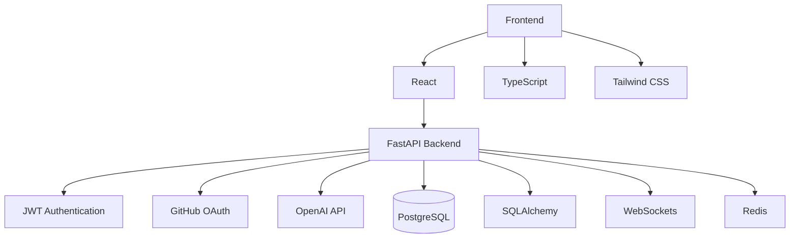

# DevLink

<p align="center">
  
</p>

<h1 align="center">DevLink</h1>

<p align="center">
<strong>Build With People Who Actually Ship.</strong>
</p>

<p align="center">
An open-source collaboration platform where developers, founders, designers,
AI engineers, and builders discover teammates, collaborate on projects,
participate in hackathons, and launch products together.
</p>

<p align="center">


</p>

---

## 🌐 Live Demo

| Website | Status |
|----------|--------|
| Coming Soon | 🚧 Under Development |

---

# Table of Contents

- Overview
- Why DevLink?
- Features
- Architecture
- Tech Stack
- Project Structure
- Screenshots
- Getting Started
- Environment Variables
- Development Workflow
- API Documentation
- Roadmap
- Contributing
- ECSoc 2026
- Security
- Code of Conduct
- License
- Maintainers

---

# Overview

DevLink is an open-source developer collaboration platform designed for developers, startup founders, designers, AI engineers, and builders.

Finding the right people to build with shouldn't require endless scrolling through Discord servers, LinkedIn, GitHub repositories, or Twitter.

DevLink brings everything together in one place.

Whether you're looking for:

- Open Source Contributors
- Startup Co-founders
- Hackathon Teammates
- Freelance Developers
- AI Engineers
- UI/UX Designers

DevLink helps you discover builders, showcase your skills, collaborate on projects, and ship products faster.

---

# Why DevLink?

### Discover Builders

Find developers with matching skills and interests.

### Build Together

Create projects and invite teammates.

### Showcase Your Work

Build a developer portfolio that goes beyond a traditional resume.

### Join Hackathons

Discover hackathons and find teammates instantly.

### AI-Powered Recommendations

Get intelligent teammate and project recommendations.

### One Platform

Everything developers need—from networking to collaboration.

---

# Features

## Developer Profiles

- Professional portfolios
- Skills & tech stack
- Experience
- GitHub integration
- Social links

---

## Project Marketplace

- Browse projects
- Create projects
- Join teams
- Apply to contribute
- Bookmark projects

---

## Team Matching

- Skill matching
- Experience matching
- AI recommendations
- Availability filters

---

## Collaboration

- Real-time messaging
- Team workspaces
- Notifications
- Discussions

---

## Community

- Builder feed
- Open Source projects
- Startup Hub
- Events
- Hackathons

---

## AI Features

- Smart teammate recommendations
- Project recommendations
- AI profile suggestions
- AI skill analysis

---

# Architecture



---

# Tech Stack

| Layer | Technology |
|--------|------------|
| Frontend | React 19 |
| Language | TypeScript |
| Styling | Tailwind CSS v4 |
| Backend | Python, FastAPI |
| Database | PostgreSQL |
| ORM | SQLAlchemy |
| Authentication | JWT, GitHub OAuth |
| Validation | Pydantic |
| Realtime | WebSockets |
| AI | OpenAI API, MCP |
| DevOps | Docker, GitHub Actions |
| Deployment | Vercel |

---

# Project Structure

```
devlink/

├── backend/
│   ├── app/
│   ├── api/
│   ├── models/
│   ├── schemas/
│   ├── services/
│   ├── core/
│   └── tests/
│
├── frontend/
│   ├── src/
│   │   ├── app/
│   │   ├── assets/
│   │   ├── components/
│   │   ├── hooks/
│   │   ├── pages/
│   │   ├── services/
│   │   ├── styles/
│   │   ├── types/
│   │   └── utils/
│
├── docs/
│
├── .github/
│
├── docker/
│
├── public/
│
├── README.md
│
├── CONTRIBUTING.md
│
├── CODE_OF_CONDUCT.md
│
├── SECURITY.md
│
└── LICENSE
```

---

# Screenshots

## Landing Page

> Coming Soon

---

## Dashboard

> Coming Soon

---

## Builder Profile

> Coming Soon

---

## Project Marketplace

> Coming Soon

---

## Messages

> Coming Soon

---

# Getting Started

## Prerequisites

- Node.js 20+
- Python 3.11+
- PostgreSQL
- Git
- Docker (Optional)

---

## Clone Repository

```bash
git clone https://github.com/nensii21/devlink.git

cd devlink
```

---

## Backend Setup

```bash
cd backend

python -m venv venv

source venv/bin/activate

pip install -r requirements.txt

uvicorn app.main:app --reload
```

---

## Frontend Setup

```bash
cd frontend

npm install

npm run dev
```

---

Visit

```
http://localhost:5173
```

---

# Environment Variables

Backend

```env
DATABASE_URL=

SECRET_KEY=

JWT_ALGORITHM=

ACCESS_TOKEN_EXPIRE_MINUTES=

GITHUB_CLIENT_ID=

GITHUB_CLIENT_SECRET=

OPENAI_API_KEY=
```

Frontend

```env
VITE_API_URL=http://localhost:8000

VITE_APP_NAME=DevLink
```

---

## Managing Secrets (local development)

IMPORTANT: Do not commit real secrets to the repository. Use `backend/.env.example` as a template and create a local `backend/.env` that is ignored by git.

1. Copy the example file locally:

```bash
cp backend/.env.example backend/.env
```

2. Generate a strong `SECRET_KEY` (example using Python):

```bash
python -c "import secrets; print(secrets.token_urlsafe(48))" > /dev/null
# then paste the printed value into backend/.env for SECRET_KEY
```

Or using OpenSSL:

```bash
openssl rand -base64 48
```

3. Store database credentials locally only (do not commit). For development with `docker-compose`, you can set the DB password in your shell or a local `.env` copied from the example:

```bash
export POSTGRES_PASSWORD="your_local_db_password"
docker compose up
```

4. Rotating secrets:

- Revoke or rotate any API keys (OpenAI, Cloudinary, AWS) from their provider consoles.
- Change your database password and update any environment variables or secret stores.
- Generate a new `SECRET_KEY` and deploy it to your environment.
- Invalidate existing user sessions/tokens if possible (rotate DB token version or flush token blacklist store).

5. After rotating, ensure CI/CD uses secure secret storage (GitHub Actions secrets, Vault, AWS Secrets Manager) rather than reading secrets from repo files.

If any secret was previously committed, remove it from git history (force push required). See the Security section for suggested steps.


# Development Workflow

```
Fork Repository

↓

Create Branch

↓

Develop Feature

↓

Test Changes

↓

Commit Changes

↓

Push Branch

↓

Open Pull Request

↓

Code Review

↓

Merge
```

---

# API Documentation

API documentation will be available at

```
http://localhost:8000/docs
```

Swagger UI will automatically generate API documentation using FastAPI.

---

# Roadmap

## Phase 1

- ✅ Landing Page
- ✅ Authentication UI
- ✅ Dashboard UI
- ✅ Builder Profiles

---

## Phase 2

- ⬜ Backend APIs
- ⬜ Project Marketplace
- ⬜ Team Applications
- ⬜ Search
- ⬜ Notifications

---

## Phase 3

- ⬜ AI Team Matching
- ⬜ AI Recommendations
- ⬜ Startup Hub
- ⬜ Messaging
- ⬜ Hackathons

---

## Phase 4

- ⬜ Mobile App
- ⬜ Organizations
- ⬜ Premium Features
- ⬜ Public API
- ⬜ Browser Extension

---

# Contributing

We welcome contributions from developers of all experience levels.

Please read **CONTRIBUTING.md** before creating a Pull Request.

### Contribution Workflow

```bash
git checkout -b feat/feature-name

git commit -m "feat: add feature"

git push origin feat/feature-name
```

Please ensure:

- Code follows existing style
- No breaking changes
- Documentation is updated
- Build passes successfully
- Pull Requests remain focused

---

# ECSoc 2026

DevLink is proud to participate in **ECSoc 2026**.

We welcome contributors from all backgrounds.

Look for labels such as:

- good first issue
- frontend
- backend
- documentation
- accessibility
- enhancement
- help wanted

We encourage first-time contributors to start with beginner-friendly issues.

---

# Security

If you discover a security vulnerability, please **do not** create a public issue.

Instead, report it privately by following the instructions in **SECURITY.md**.

---

# Code of Conduct

Please read our **CODE_OF_CONDUCT.md** before participating.

We are committed to creating a welcoming, inclusive, and respectful community.

---

# License

Distributed under the **MIT License**.

See **LICENSE** for more information.

---

# Maintainers

| Name | Role |
|------|------|
| **Nensi Patel (@nensii21)** | Project Lead & Maintainer |

---

# Acknowledgements

Special thanks to:

- All open-source contributors
- ECSoc 2026
- The React community
- The FastAPI community
- Every developer helping build DevLink

---

<p align="center">

## ⭐ If you like DevLink, consider giving the repository a star!

Made with ❤️ by developers, for developers.

Building the future of developer collaboration.

</p>
