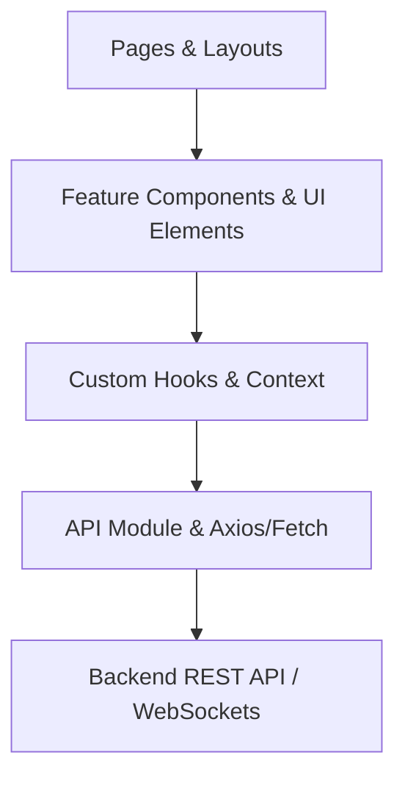
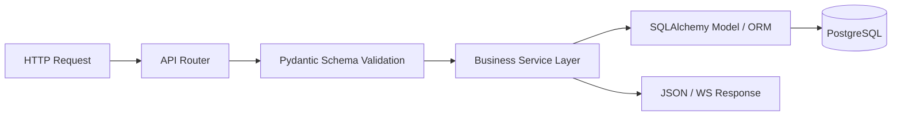
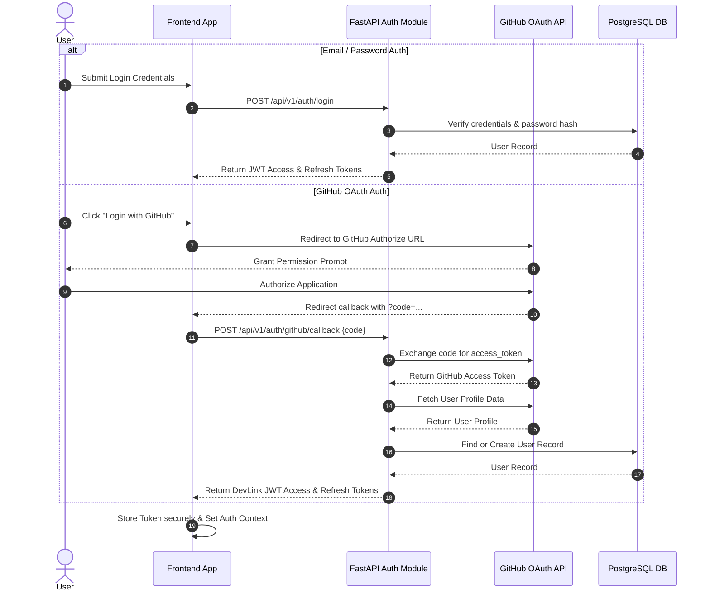
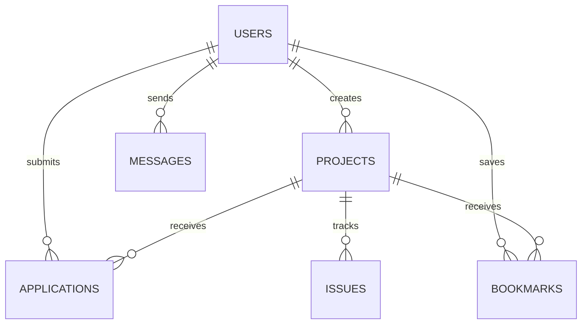
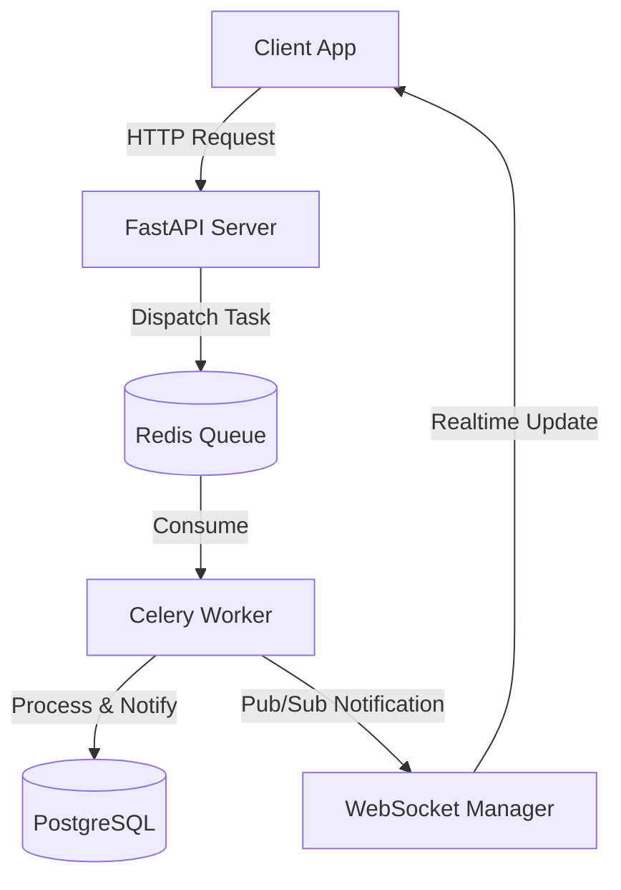

# DevLink Architecture Documentation

This document provides a comprehensive overview of the DevLink architecture, explaining the overall system design, key components, data flow, background processing, and integration patterns.

---

## 1. High-Level Architecture

DevLink uses a decoupled client-server architecture. The frontend is a single-page / server-rendered web application built with React/Next.js and dynamic routing, while the backend is an asynchronous Python API built with FastAPI, PostgreSQL, and Redis.

```mermaid
graph TB
    subgraph Client Layer
        UserClient[Browser / Client App]
    end

    subgraph API Gateway & Presentation
        ReverseProxy[Nginx / Cloudflare Ingress]
        FrontendApp[Frontend Application (React/Next.js)]
    end

    subgraph Core Backend Services
        FastAPI[FastAPI Application Server]
        AuthService[Auth & OAuth Module]
        MatchService[Matching Algorithm Engine]
        WebSocketService[Realtime WebSocket Engine]
    end

    subgraph Data & Storage Layer
        PostgreSQL[(PostgreSQL Relational DB)]
        Redis[(Redis Cache & Pub/Sub)]
        GCS[Cloud Object Storage]
    end

    subgraph Asynchronous Workers
        CeleryWorker[Background Workers (Celery/Task Queue)]
    end

    subgraph External Integrations
        GitHub[GitHub API]
        OpenAI[OpenAI / LLM API]
    end

    UserClient -->|HTTPS / WSS| ReverseProxy
    ReverseProxy -->|Static / SSR| FrontendApp
    ReverseProxy -->|REST API & WS| FastAPI

    FastAPI --> AuthService
    FastAPI --> MatchService
    FastAPI --> WebSocketService
    FastAPI --> PostgreSQL
    FastAPI --> Redis

    FastAPI --> CeleryWorker
    CeleryWorker --> PostgreSQL
    CeleryWorker --> Redis
    CeleryWorker --> GCS

    AuthService --> GitHub
    MatchService --> OpenAI
    CeleryWorker --> OpenAI
```

---

## 2. Frontend Architecture

The frontend application is structured for high modularity, performance, and type safety using React 19, TypeScript, and Tailwind CSS.

### Component Layering
* **App & Routing**: Next.js App Router / TanStack Router managing application routes and layout wrappers.
* **Feature Modules**: Self-contained components and hooks structured by domain (`profile`, `projects`, `chat`, `matching`, `settings`).
* **UI Component Library**: Reusable UI components built on accessibility standards (Radix UI primitives, Tailwind styling).
* **State & Data Fetching**: React Query / Custom Hooks handling asynchronous API state, caching, optimism, and synchronization.



---

## 3. Backend Architecture

The backend is built with FastAPI to deliver high-performance, asynchronous REST API endpoints and WebSockets for real-time capabilities.

### Key Architectural Layers
1. **API Router Layer (`app/api`)**: Endpoint definitions, query parameter parsing, and route handling.
2. **Schema Layer (`app/schemas`)**: Pydantic models for request validation and response serialization.
3. **Service Layer (`app/services`)**: Business logic processing, matching calculations, and external integrations.
4. **Data Access Layer (`app/models`)**: SQLAlchemy ORM models interacting with PostgreSQL.
5. **Core Config & Security (`app/core`)**: Application configuration, security utilities, and database sessions.



---

## 4. Authentication Flow

DevLink supports both traditional email/password authentication (JWT) and OAuth 2.0 (GitHub).

### JWT & OAuth Authentication Sequence



---

## 5. Database Interaction

DevLink utilizes PostgreSQL as its primary transactional database with SQLAlchemy ORM for schema definition and query management.

* **Migrations**: Managed via Alembic for version-controlled database schema changes.
* **Connection Pooling**: SQLAlchemy async engines utilize connection pooling for high throughput.
* **Caching Layer**: Redis caches frequent queries (such as user profiles, matching metadata, and active socket sessions) to minimize database hit frequency.



---

## 6. Background Jobs & Real-Time Processing

Complex operations and notifications run outside the synchronous HTTP request/response cycle.

* **Background Task Queue**: Celery workers powered by Redis as a message broker handle asynchronous tasks like sending emails, processing uploaded resumes/portfolios, and periodic GitHub repository syncing.
* **Real-time WebSockets**: Async WebSocket handlers manage instant messaging, typing indicators, online state, and immediate notification dispatching.



---

## 7. External Services Integration

DevLink integrates with third-party APIs to provide rich user profiles and AI features:

1. **GitHub API**: Fetch user repositories, commit statistics, open-source activity, and contribution graphs.
2. **OpenAI API / LLM Providers**: Power smart teammate matching, automated bio summaries, project compatibility scoring, and skill extraction.
3. **Cloud Object Storage (S3 / GCS)**: Store user avatars, uploaded resumes, and project assets securely.

---

## 8. Navigation & Document Links

* [Deployment Guide](deployment.md)
* [Development Guide](development.md)
* [Coding Standards](coding-standards.md)
* [Root README](../README.md)
