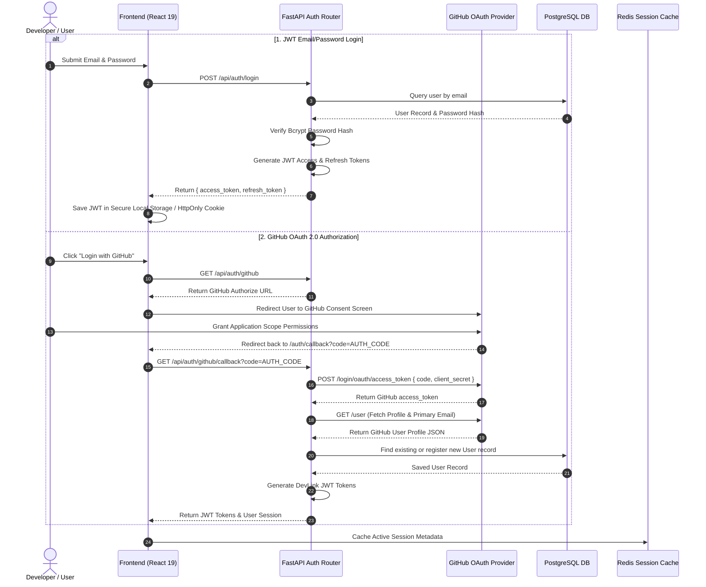
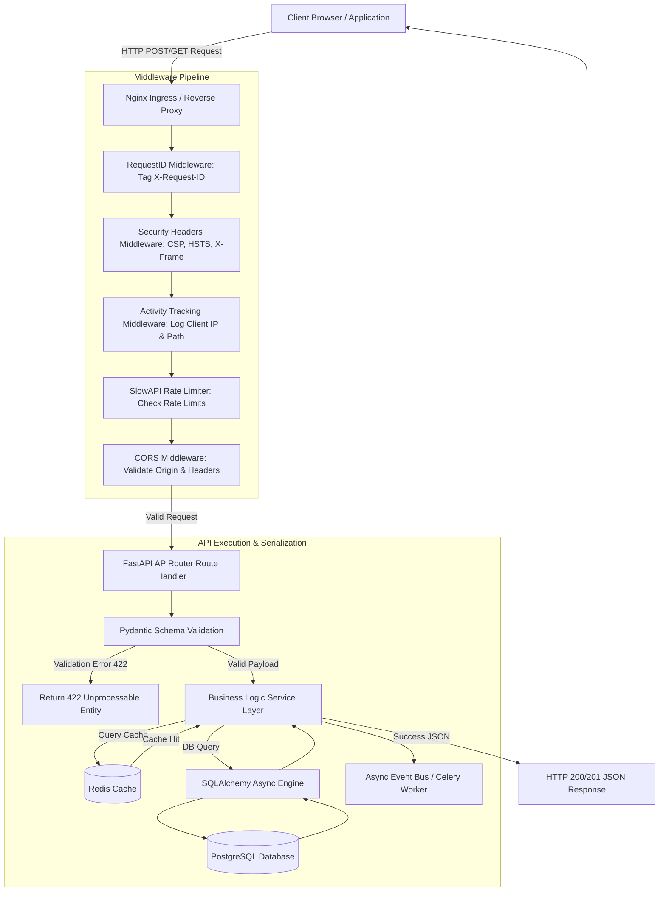
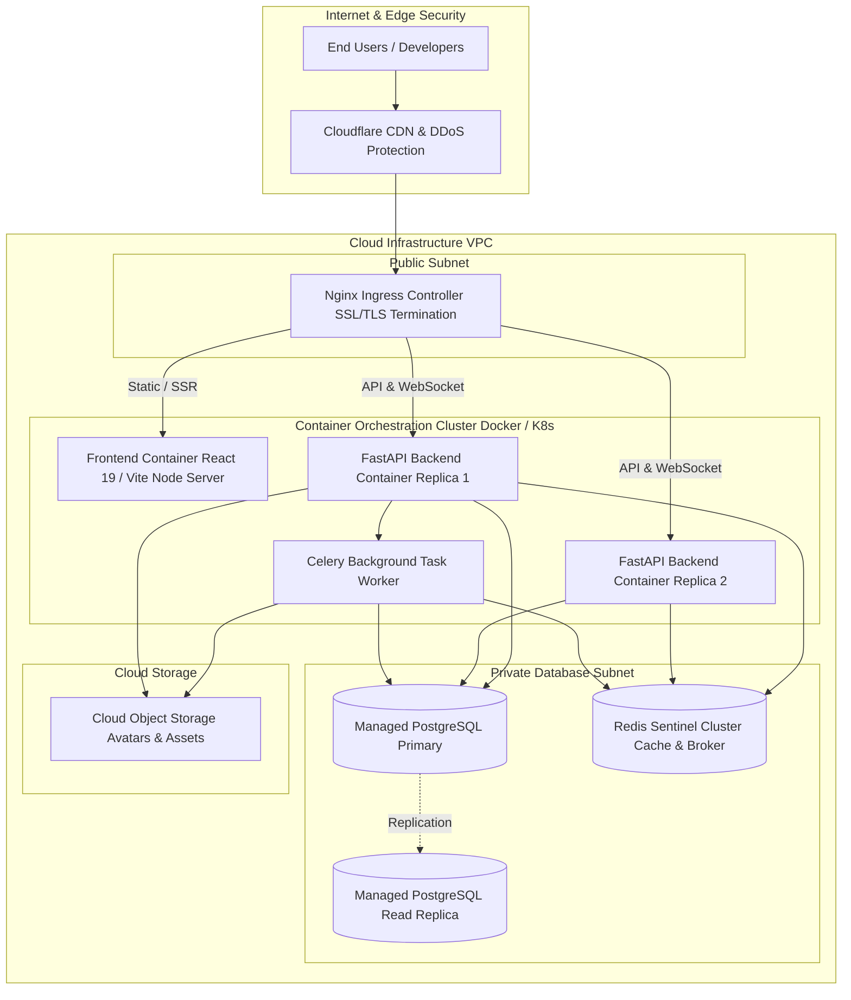

# DevLink System Architecture & Mermaid Diagrams

This document provides comprehensive architectural specifications and visual Mermaid diagrams for DevLink, including authentication flows, request lifecycle pipelines, component architecture, database entity relationships (ERD), and containerized deployment topology.

---

## 📑 Table of Contents

1. [Authentication Architecture](#1-authentication-architecture)
2. [Request Lifecycle Pipeline](#2-request-lifecycle-pipeline)
3. [Component Architecture](#3-component-architecture)
4. [Database Entity Relationship Diagram (ERD)](#4-database-entity-relationship-diagram-erd)
5. [Deployment Architecture Topology](#5-deployment-architecture-topology)

---

## 1. Authentication Architecture

DevLink supports dual authentication pathways: standard **JWT Credentials** (email/password with bcrypt hashing) and **GitHub OAuth 2.0**.



---

## 2. Request Lifecycle Pipeline

Every incoming HTTP request traverses a series of security, rate limiting, and validation middleware layers before reaching business services and returning a response.



---

## 3. Component Architecture

DevLink is structured into decoupled frontend presentation modules and modular backend domain routers/services.

```mermaid
graph TB
    subgraph Frontend Application Layer React 19 / TypeScript
        UI[Pages & Layout Components]
        Routes[TanStack Router / App Routes]
        Contexts[Sidebar, Auth & Theme Contexts]
        
        subgraph Feature Components
            ProfileComp[Profile & Teammate Cards]
            ProjectComp[Project Marketplace & Filters]
            ChatComp[WebSocket Direct Messenger]
            SearchComp[Global Search & Suggestions]
        end

        Query[TanStack React Query Cache]
        APIClient[Axios / Fetch API Client Layer]
        
        UI --> Routes
        Routes --> Feature Components
        Feature Components --> Contexts
        Feature Components --> Query
        Query --> APIClient
    end

    subgraph Backend Application Layer FastAPI / Python
        APIClient -->|REST & WebSockets| APIGateway[FastAPI Application Gateway]

        subgraph Router Modules
            AuthRouter[app/routers/auth.py]
            UserRouter[app/routers/users.py]
            ProjRouter[app/routers/projects.py]
            MsgRouter[app/routers/messages.py]
            RecRouter[app/routers/recommendations.py]
            WSRouter[app/routers/websockets.py]
        end

        subgraph Core Business Services
            AuthService[Authentication & Password Hash Service]
            MatchService[Teammate Matching Engine]
            WSService[WebSocket Connection Manager]
            QualityService[Repo Quality Scoring Service]
        end

        APIGateway --> Router Modules
        AuthRouter --> AuthService
        UserRouter --> QualityService
        ProjRouter --> MatchService
        RecRouter --> MatchService
        WSRouter --> WSService
        MsgRouter --> WSService
    end

    subgraph Infrastructure Layer
        AuthService --> DB[(PostgreSQL)]
        MatchService --> Redis[(Redis)]
        WSService --> Redis
    end
```

---

## 4. Database Entity Relationship Diagram (ERD)

The PostgreSQL relational schema models users, projects, applications, direct messages, bookmarks, and activity feeds.

```mermaid
erDiagram
    USERS {
        uuid id PK
        string email UK
        string username UK
        string password_hash
        string full_name
        string headline
        text bio
        string avatar_url
        string github_username
        jsonb skills
        jsonb social_links
        timestamp created_at
    }

    PROJECTS {
        uuid id PK
        uuid owner_id FK
        string title
        string tagline
        text description
        string category
        jsonb tech_stack
        jsonb open_roles
        string repository_url
        int stars_count
        timestamp created_at
    }

    APPLICATIONS {
        uuid id PK
        uuid project_id FK
        uuid applicant_id FK
        string role_applied
        text cover_note
        string status
        timestamp created_at
    }

    MESSAGES {
        uuid id PK
        uuid conversation_id FK
        uuid sender_id FK
        text content
        boolean read_status
        timestamp created_at
    }

    CONVERSATIONS {
        uuid id PK
        uuid participant_a FK
        uuid participant_b FK
        timestamp updated_at
    }

    BOOKMARKS {
        uuid id PK
        uuid user_id FK
        uuid project_id FK
        timestamp created_at
    }

    BUILDER_FLARES {
        uuid id PK
        uuid user_id FK
        string title
        text content
        jsonb tags
        timestamp created_at
    }

    FOLLOWERS {
        uuid id PK
        uuid follower_id FK
        uuid following_id FK
        timestamp created_at
    }

    USERS ||--o{ PROJECTS : "creates and owns"
    USERS ||--o{ APPLICATIONS : "submits"
    PROJECTS ||--o{ APPLICATIONS : "receives"
    USERS ||--o{ BOOKMARKS : "saves"
    PROJECTS ||--o{ BOOKMARKS : "bookmarked by"
    USERS ||--o{ MESSAGES : "sends"
    CONVERSATIONS ||--o{ MESSAGES : "contains"
    USERS ||--o{ CONVERSATIONS : "participates in"
    USERS ||--o{ BUILDER_FLARES : "posts"
    USERS ||--o{ FOLLOWERS : "follows / followed by"
```



---

## 5. Deployment Architecture Topology

Production deployment topology using containerized microservices behind a high-availability reverse proxy and managed cloud infrastructure.



---

## 🔗 Related Documentation

* [API Reference](api.md)
* [Development Setup](development.md)
* [Deployment Guide](deployment.md)
* [Coding Standards](coding-standards.md)
